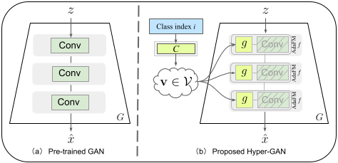
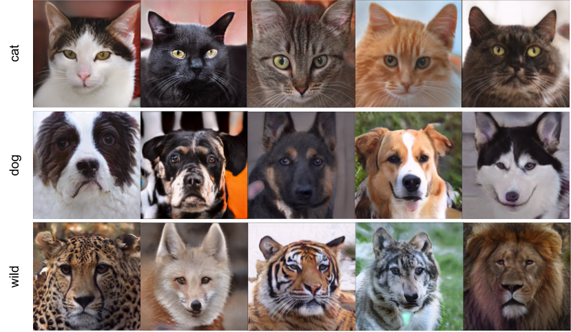

Transferring Unconditional to Conditional GANs with Hyper-Modulation
--------------------------------------------------------------------

_GANs have matured in recent years and are able to generate high-resolution, realistic images. However, the computational resources and the data required for the training of high-quality GANs are enormous, and the study of transfer learning of these models is therefore an urgent topic. Many of the available high-quality pretrained GANs are unconditional (like StyleGAN). For many applications, however, conditional GANs are preferable, because they provide more control over the generation process, despite often suffering more training difficulties. Therefore, in this paper, we focus on transferring from high-quality pretrained unconditional GANs to conditional GANs. This requires architectural adaptation of the pretrained GAN to perform the conditioning. To this end, we propose hyper-modulated generative networks that allow for shared and complementary supervision. To prevent the additional weights of the hypernetwork to overfit, with subsequent mode collapse on small target domains, we introduce a self-initialization procedure that does not require any real data to initialize the hypernetwork parameters. To further improve the sample efficiency of the transfer, we apply contrastive learning in the discriminator, which effectively works on very limited batch sizes. In extensive experiments, we validate the efficiency of the hypernetworks, self-initialization and contrastive loss for knowledge transfer on standard benchmarks._

<p align="center">
  
</p>

Official implementation of [Hyper-Modulation](https://arxiv.org/abs/2112.02219).

<p align="center">
  
  <br>
  Given a pre-trained model, our hyper-modulation method learns to use its knowledge to produce out-of-domain generalizations. I.e., trained on human faces, it quickly learns animal faces (above) or further domains like objects and places (paper). No finetuning is needed. It also preserves and responds to the source domain style mechanism.
</p>

### Environment
Please install the required packages with conda and activate the environment
```bash
conda env create -f environment.yml
conda activate hypermod
```

### Base model
Pretrained unconditional models are available in the [base code repository](https://github.com/rosinality/style-based-gan-pytorch), concretely we used [this one](https://drive.google.com/open?id=1QlXFPIOFzsJyjZ1AtfpnVhqW4Z0r8GLZ) trained on FFHQ dataset.
Let's assume it's downloaded in `<base_model>`.

### Data
To replicate the stated results, please download [AFHQ(v1)](https://github.com/clovaai/stargan-v2/blob/master/README.md#animal-faces-hq-dataset-afhq).
Additional datasets like FFHQ, CelebA-HQ, Flowers102standard, Places356 can be downloaded from their respective sources.

Once downloaded and extracted, the dataset must be preprocessed into an LMDB file with the following command
```bash
python prepare_data.py <dataset>/train/ --labels --sizes 256 --out <lmdb_dataset>
```
The directory given to `prepare_data.py` must contain a folder per class, class samples within each respective folder as specified by [ImageFolder](https://pytorch.org/vision/stable/datasets.html#torchvision.datasets.ImageFolder) dataset.

Additionally, we can compute the inception features of the dataset to calculate the metrics later.
```bash
python metrics.py <lmdb_dataset> --output_path <dataset_inception_feats> --batch_size 32 --operation extract-feats
```

### Training

#### Self-alignment

```bash
python self_alignment.py <base_model> --batch_size 32 --name <self_aligned_checkpoints> --checkpoint_interval 1000 --iterations 10000
```
The model checkpoints will begin to get saved under `checkpoint/self_align/<self_aligned_checkpoints>` folder (can be specified with `--checkpoint_dir`).
Additional losses are also saved, can be visualized pointing tensorboard to folder `runs/self_align/` (can be specified with `--log_dir`).

To assess the quality we can start computing metrics for each checkpoint with
```bash
python metrics.py checkpoint/self_align/<self_aligned_checkpoints> --precomputed_feats <dataset_inception_feats> --batch_size 32 --operation metrics
```
For each checkpoint, a `.metric` file will be created containing the computed scores. The function `class_mean()` from `utils.py` can be used to read the whole directory.
One would normally want to plot the metric evolution over time, which can be done as
```python
import matplotlib.pyplot as plt
from utils import class_mean

p = 'checkpoint/self_align/<self_aligned_checkpoints>'
plt.plot(*class_mean(p, metric='fid', return_steps=True))
```
We then pick a checkpoint with good enough scores. We will name it `<self_aligned_model>`.

#### Transfer learning

To run the actual training, we can do
```bash
python train.py <lmdb_dataset> --ckpt <self_aligned_model> --max_size 256 --loss r1 --const_alpha 1 --phase 3000000 --batch_default 10 --init_size 256 --mixing --name <training_name> --checkpoint_interval 1000 --iterations 200002
```

For the finetuned version
```bash
python train.py <lmdb_dataset> --finetune --ckpt <self_aligned_model> --max_size 256 --loss r1 --const_alpha 1 --phase 3000000 --batch_default 10 --init_size 256 --mixing --name <training_name> --checkpoint_interval 1000 --iterations 200002
```

For the version with contrastive learning
```bash
python train.py <lmdb_dataset> --contrastive --ckpt <self_aligned_model> --max_size 256 --loss r1 --const_alpha 1 --phase 3000000 --batch_default 10 --init_size 256 --mixing --name <training_name> --checkpoint_interval 1000 --iterations 200002
```

Generated images and loss curves are found in `tensorboard --logdir runs/` by default.
Checkpoints are saved in `checkpoint/<training_name>`, where metrics can be computed and plotted by using `metrics.py` script and `class_mean` plot the same way as for self-alignment.

Additionally, perceptual path length can be computed as
```bash
python ppl.py --checkpoint_path <checkpoint/training_name/concrete_checkpoint.model>
```

### Generation

To make use of the final models, we can directly make use of `generate.py` or `latent_interpolation.py`.

To generate a figure like the interpolation from Supplementary Material section 7 (Latent space), run
```bash
python latent_interpolation.py <final_checkpoint> --output interpolation_class_noise.png --num_interpolations 5 --type class_noise
```

### Acknowledgments

The project is based on [this StyleGAN implementation](https://github.com/rosinality/style-based-gan-pytorch). We used [PIQ](https://github.com/photosynthesis-team/piq) package for metrics, and the PPL implementation was taken from [here](https://github.com/rosinality/stylegan2-pytorch/blob/master/ppl.py).

### Citation

```
@InProceedings{Laria_2022_CVPR,
    author    = {Laria, H\'ector and Wang, Yaxing and van de Weijer, Joost and Raducanu, Bogdan},
    title     = {Transferring Unconditional to Conditional GANs With Hyper-Modulation},
    booktitle = {Proceedings of the IEEE/CVF Conference on Computer Vision and Pattern Recognition (CVPR) Workshops},
    month     = {June},
    year      = {2022},
    pages     = {3840-3849}
}
```
